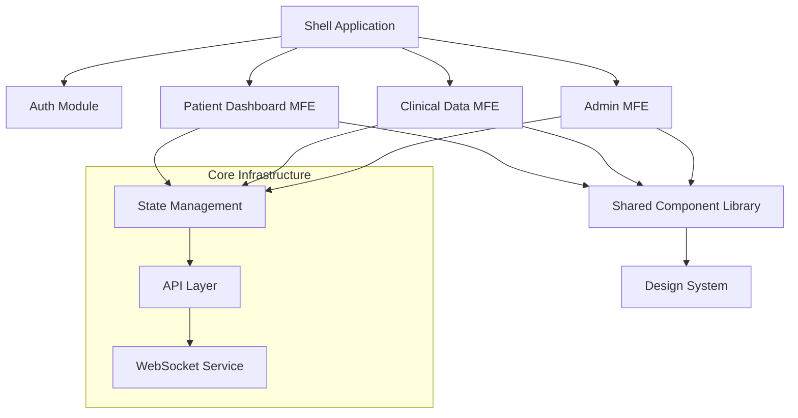
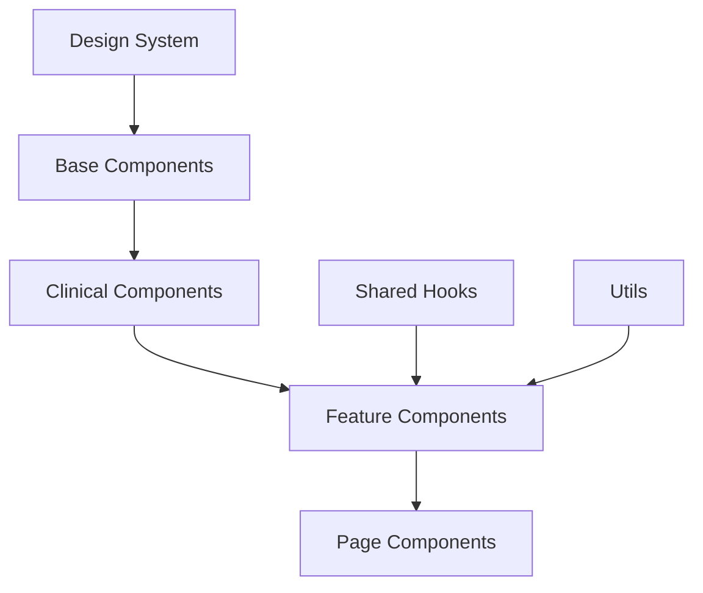
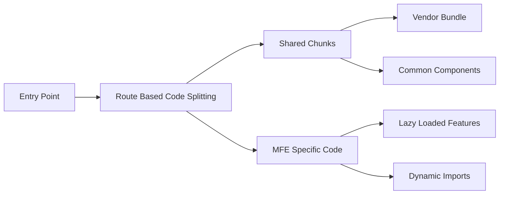
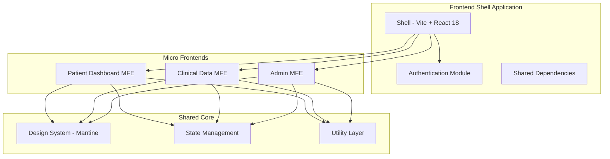
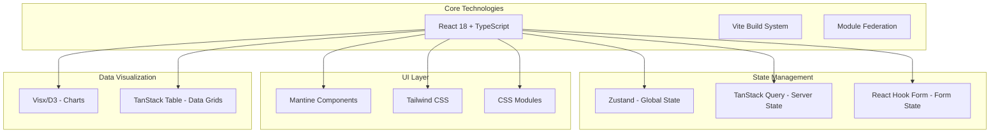

```mermaid
graph TD
    A[Shell Application] --> B[Auth Module]
    A --> C[Patient Dashboard MFE]
    A --> D[Clinical Data MFE]
    A --> E[Admin MFE]
    
    C --> F[Shared Component Library]
    D --> F
    E --> F
    
    F --> G[Design System]
    
    C --> H[State Management]
    D --> H
    E --> H
    
    subgraph "Core Infrastructure"
        H --> I[API Layer]
        I --> J[WebSocket Service]
    end
```

```mermaid
graph TD
    A[Design System] --> B[Base Components]
    B --> C[Clinical Components]
    C --> D[Feature Components]
    D --> E[Page Components]
    
    F[Shared Hooks] --> D
    G[Utils] --> D

```

```mermaid
graph LR
    A[Entry Point] --> B[Route Based Code Splitting]
    B --> C[Shared Chunks]
    B --> D[MFE Specific Code]
    
    C --> E[Vendor Bundle]
    C --> F[Common Components]
    
    D --> G[Lazy Loaded Features]
    D --> H[Dynamic Imports]
```

```mermaid
graph TD
    subgraph "Frontend Shell Application"
        A[Shell - Vite + React 18]
        B[Authentication Module]
        C[Shared Dependencies]
    end

    subgraph "Micro Frontends"
        D[Patient Dashboard MFE]
        E[Clinical Data MFE]
        F[Admin MFE]
    end

    subgraph "Shared Core"
        G[Design System - Mantine]
        H[State Management]
        I[Utility Layer]
    end

    A --> B
    A --> D
    A --> E
    A --> F
    
    D & E & F --> G
    D & E & F --> H
    D & E & F --> I
```

```mermaid
graph TD
    subgraph "Core Technologies"
        A[React 18 + TypeScript]
        B[Vite Build System]
        C[Module Federation]
    end

    subgraph "State Management"
        D[Zustand - Global State]
        E[TanStack Query - Server State]
        F[React Hook Form - Form State]
    end

    subgraph "UI Layer"
        G[Mantine Components]
        H[Tailwind CSS]
        I[CSS Modules]
    end

    subgraph "Data Visualization"
        J[Visx/D3 - Charts]
        K[TanStack Table - Data Grids]
    end

    A --> D & E & F
    A --> G & H & I
    A --> J & K
```
