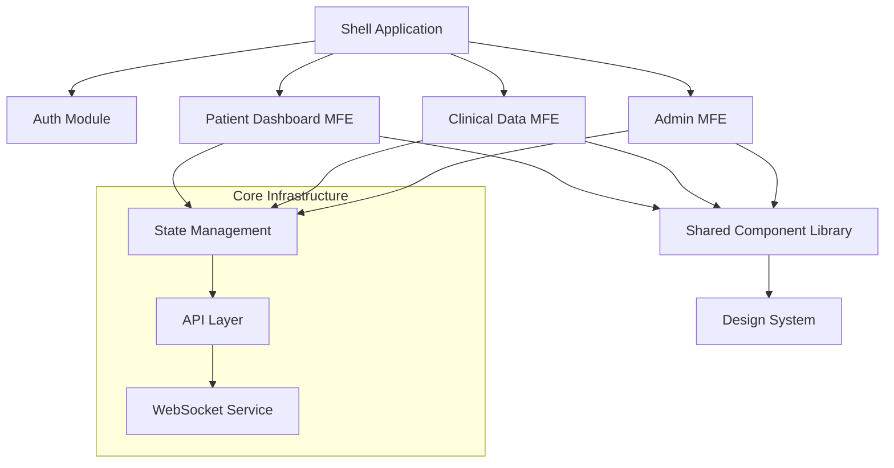

```mermaid
graph TD
    A[Shell Application] --> B[Auth Module]
    A --> C[Patient Dashboard MFE]
    A --> D[Clinical Data MFE]
    A --> E[Admin MFE]
    
    C --> F[Shared Component Library]
    D --> F
    E --> F
    
    F --> G[Design System]
    
    C --> H[State Management]
    D --> H
    E --> H
    
    subgraph "Core Infrastructure"
        H --> I[API Layer]
        I --> J[WebSocket Service]
    end
```
