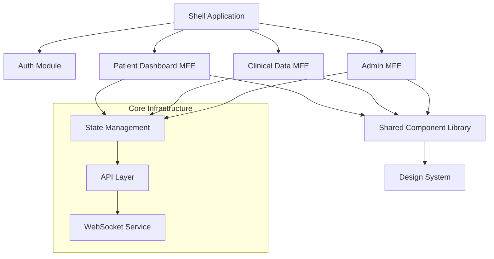
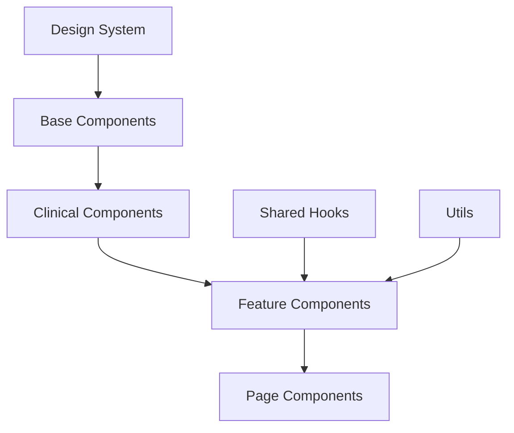
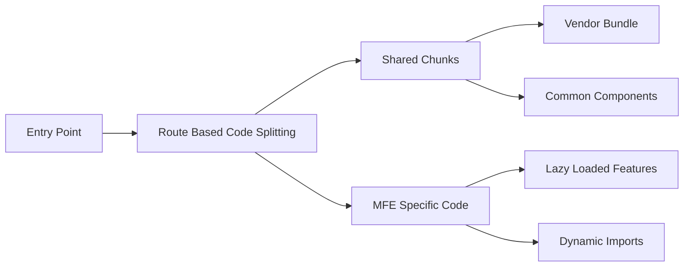

```mermaid
graph TD
    A[Shell Application] --> B[Auth Module]
    A --> C[Patient Dashboard MFE]
    A --> D[Clinical Data MFE]
    A --> E[Admin MFE]
    
    C --> F[Shared Component Library]
    D --> F
    E --> F
    
    F --> G[Design System]
    
    C --> H[State Management]
    D --> H
    E --> H
    
    subgraph "Core Infrastructure"
        H --> I[API Layer]
        I --> J[WebSocket Service]
    end
```

```mermaid
graph TD
    A[Design System] --> B[Base Components]
    B --> C[Clinical Components]
    C --> D[Feature Components]
    D --> E[Page Components]
    
    F[Shared Hooks] --> D
    G[Utils] --> D

```

```mermaid
graph LR
    A[Entry Point] --> B[Route Based Code Splitting]
    B --> C[Shared Chunks]
    B --> D[MFE Specific Code]
    
    C --> E[Vendor Bundle]
    C --> F[Common Components]
    
    D --> G[Lazy Loaded Features]
    D --> H[Dynamic Imports]
```
